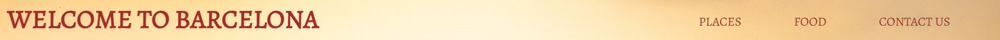
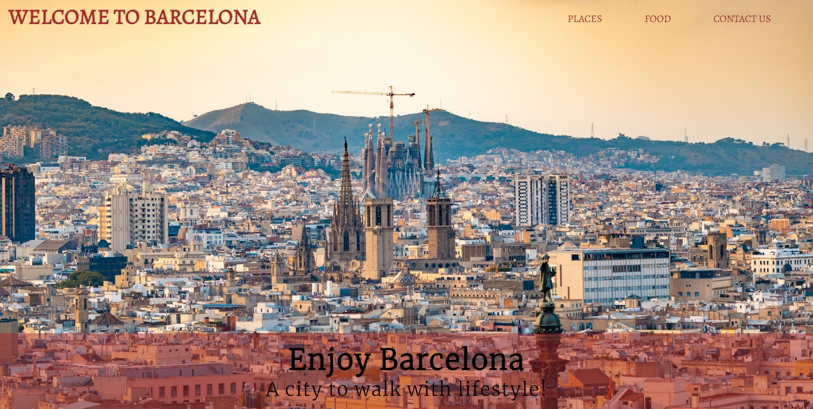
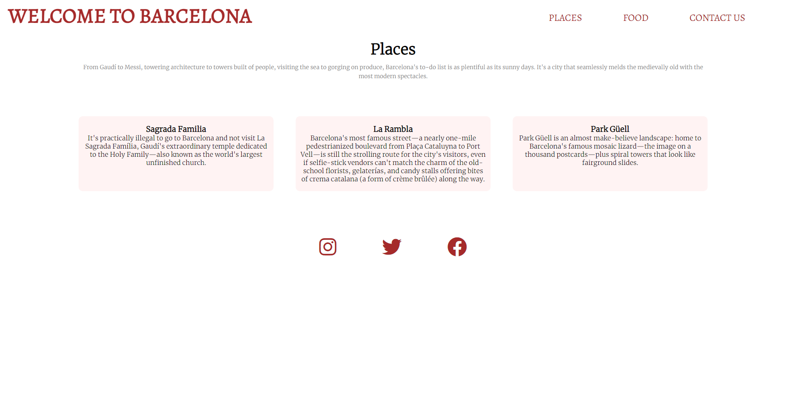
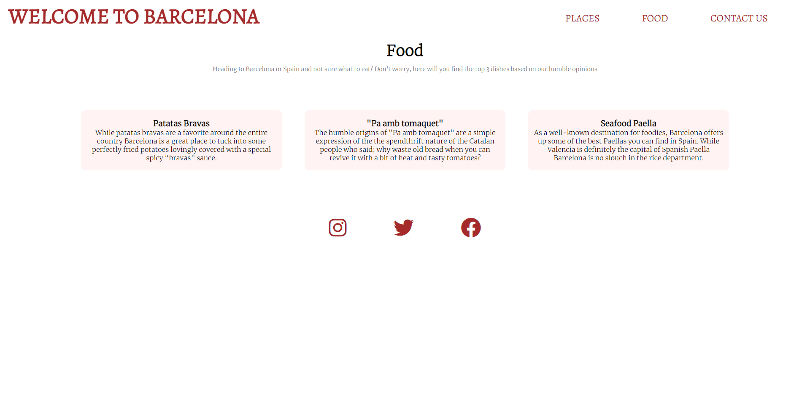
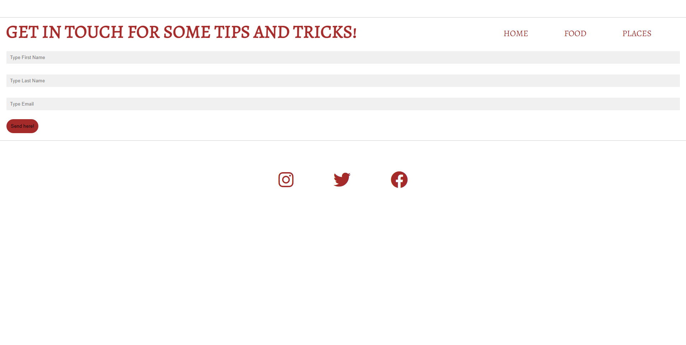
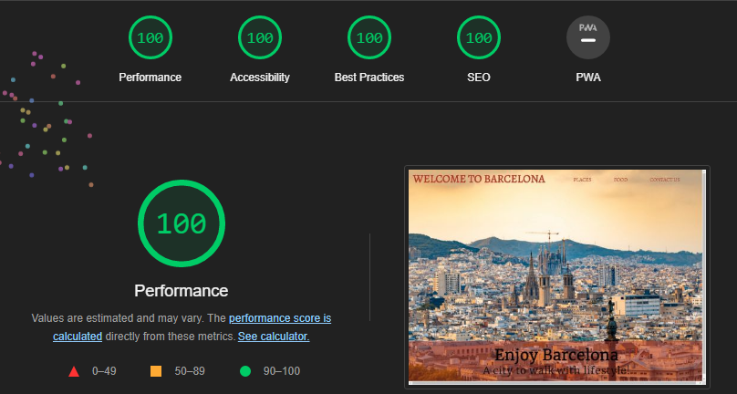

# Welcome to Barcelona!
Welcome Barcelona is a website focused on those people who want to know a bit more about the city before they travel to it.
In Welcome Barcelona users will find which places are worth visiting, the best dishes to enjoy in the city and a contact us page for further questions that users may have.
Enjoy your visit!

## Features

- __Logo and Navigation Bar__

    -  The logo on the left ("Welcome to Barcelona"), this allows the user to come back to the home page wherever the user finds itself in the page.
    -  The navigation bar on the right ('Places, Food & Contact Us'), these are links to external pages that tells the user the different pages on which it is possible to browse. 

- __The Home Page__

    - The home page shows a background image over all of barcelona, this instantly tells the user the maeaning of the site.
    - On the bottom the user can find a welcoming message.

- __The Places Page__

    - The places page gives the user a short explanation on what Barcelona has to offer.
    - The places page has three recommended monuments/places to visit, followed by a brief text explaining what you should expect about that monument/place.
    - The places page also offers the user to contact us through the icons on the bottom of the page, each icon redirect the user to the desired social media.

- __The Food Page__
    - The food page gives the user a short explanation on what Barcelona has to offer.
    - The food page has three recommended monuments/places to visit, followed by a brief text explaining what you should expect about that monument/place.
    - The food page also offers the user to contact us through the icons on the bottom of the page, each icon redirect the user to the desired social media.

- __The Contact Us Form__

    - The contact us form varies from the other pages, here the user will find the home page in the navigation bar instead of on the logo.
    - The contact us form allows the user to contact the page owner by giving its' first name, last name and email.
    - The contact us form also offers the user to contact us through the icons on the bottom of the page, each icon redirect the user to the desired social media.

  

## Testing

- I tested that the page works in different browsers such as: Chrome, Internet Explorer and Safari.
- I have assured that the logo, navigation, home page, places page, food page and contact us page are all redeable and easy to comprehend.
- The form requires entries for: first name, last name, email and the submit button('Send here!'), which also works.

**Bugs**
No bugs found

**Validator Testing**
    
- __HTML__

    - No errors were returned when passing through the official W3C validator.

- __CSS__

    - No errors were found when passing through the official (Jigsaw) validator.

- __Accessibility__

    - I confirmed that the colors and fonts chosen are easy to read and accessible by running it through "lighthouse" in devtools.

**Unfixed bugs**
No unfixed founds

## Deployment

- __The was deployed to GitHub pages. The steps to deploy are as follows:__
    - In the GitHub repository, navigate to the settings tab.
    - On the setting selection to the left, select "Pages".
    - From the source section drop-down menu, select Master Branch.
    - Once the master branch has been selected, the page provided the link to the completed website.

The live link can be found here [Welcome to Barcelona](https://benyaminmn.github.io/welcome-to-barcelona/index.html)

## Credits

**Content**
- The opaque background code was taken from [W3C Schools](https://www.w3schools.com/howto/howto_css_image_transparent.asp).
- The form, food, and places style was inspired on this [video](https://www.youtube.com/watch?v=oYRda7UtuhA&t=522s&ab_channel=EasyTutorials)

**Media**
- The image in the Home Page was taken from [Pexels](https://www.pexels.com/).
